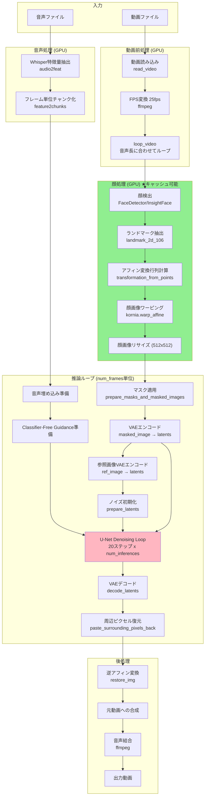
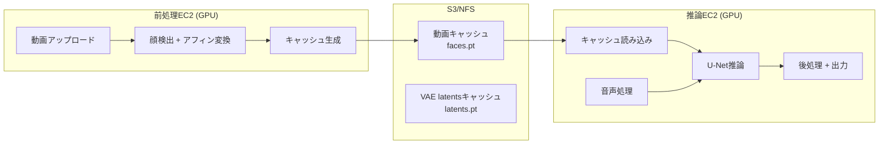

# LatentSync 推論パイプライン分析レポート

## 1. 推論パイプラインの処理フロー解析

### 処理フロー図 (Mermaid)



### 処理ステップ詳細

#### Step 1: 動画読み込みとFPS変換
- **実行ファイル/関数**: `latentsync/utils/util.py:read_video()` (L46-63)
- **入力**: 動画ファイルパス
- **出力**: `np.ndarray` shape=(frames, H, W, 3) dtype=uint8
- **GPU/CPU**: CPU (ffmpeg) + CPU (OpenCV/decord)
- **キャッシュ可能**: No (毎回読み込む必要あり)
- **推定処理時間**: ~5秒/1分動画

#### Step 2: 音声特徴量抽出 (Whisper)
- **実行ファイル/関数**: `latentsync/whisper/audio2feature.py:audio2feat()` (L120-140)
- **入力**: 音声ファイルパス
- **出力**: `torch.Tensor` shape=(audio_length, embedding_dim) ※embedding_dim=384 or 768
- **GPU/CPU**: GPU (Whisper)
- **キャッシュ可能**: Yes（音声ごと）★ 既にキャッシュ機構あり
- **推定処理時間**: ~10秒/1分動画

#### Step 3: 音声チャンク化
- **実行ファイル/関数**: `latentsync/whisper/audio2feature.py:feature2chunks()` (L88-103)
- **入力**: whisper特徴量, FPS
- **出力**: `List[torch.Tensor]` 各要素 shape=(audio_feat_length*2, embedding_dim)
- **GPU/CPU**: CPU
- **キャッシュ可能**: Yes（Step 2と同時にキャッシュ可能）
- **推定処理時間**: ~1秒

#### Step 4: 動画ループ処理
- **実行ファイル/関数**: `latentsync/pipelines/lipsync_pipeline.py:loop_video()` (L281-310)
- **入力**: whisper_chunks, video_frames
- **出力**: video_frames, faces, boxes, affine_matrices
- **GPU/CPU**: GPU (顔検出)
- **キャッシュ可能**: 部分的（動画依存部分のみ）
- **推定処理時間**: ~30秒/1分動画

#### Step 5: 顔検出
- **実行ファイル/関数**: `latentsync/utils/face_detector.py:FaceDetector.__call__()` (L17-69)
- **入力**: フレーム画像 `np.ndarray` (H, W, 3)
- **出力**:
  - `bbox`: (x1, y1, x2, y2) tuple
  - `landmark_2d_106`: `np.ndarray` shape=(106, 2)
- **GPU/CPU**: GPU (InsightFace)
- **キャッシュ可能**: Yes ★重要
- **推定処理時間**: ~20ms/フレーム = ~30秒/1分動画(1500フレーム)

#### Step 6: アフィン変換
- **実行ファイル/関数**: `latentsync/utils/image_processor.py:ImageProcessor.affine_transform()` (L54-71)
- **入力**: フレーム画像, ランドマーク
- **出力**:
  - `face`: `torch.Tensor` shape=(3, 512, 512)
  - `box`: [x1, y1, x2, y2]
  - `affine_matrix`: `torch.Tensor` shape=(1, 2, 3)
- **GPU/CPU**: GPU (kornia.warp_affine)
- **キャッシュ可能**: Yes ★重要
- **推定処理時間**: ~10ms/フレーム = ~15秒/1分動画

#### Step 7: マスク準備
- **実行ファイル/関数**: `latentsync/utils/image_processor.py:prepare_masks_and_masked_images()` (L82-91)
- **入力**: 変換済み顔画像群
- **出力**: pixel_values, masked_pixel_values, masks (各 torch.Tensor)
- **GPU/CPU**: CPU→GPU
- **キャッシュ可能**: No（顔画像自体がキャッシュされていれば高速）
- **推定処理時間**: ~5秒

#### Step 8: VAEエンコード (Masked Image)
- **実行ファイル/関数**: `lipsync_pipeline.py:prepare_mask_latents()` (L193-220)
- **入力**: mask, masked_image
- **出力**:
  - `mask`: shape=(2, 1, num_frames, H/8, W/8)
  - `masked_image_latents`: shape=(2, 4, num_frames, H/8, W/8)
- **GPU/CPU**: GPU (VAE)
- **キャッシュ可能**: Yes（動画のみに依存）
- **推定処理時間**: ~10秒

#### Step 9: VAEエンコード (Reference Image)
- **実行ファイル/関数**: `lipsync_pipeline.py:prepare_image_latents()` (L222-229)
- **入力**: reference images
- **出力**: `ref_latents`: shape=(2, 4, num_frames, H/8, W/8)
- **GPU/CPU**: GPU (VAE)
- **キャッシュ可能**: Yes（動画のみに依存）
- **推定処理時間**: ~10秒

#### Step 10: U-Net Denoising (★ボトルネック)
- **実行ファイル/関数**: `lipsync_pipeline.py:__call__()` L424-451
- **入力**:
  - `unet_input`: shape=(2, 4+1+4+4=13, num_frames, 64, 64)
  - `audio_embeds`: shape=(2*num_frames, audio_feat_length, embedding_dim)
  - `timesteps`: スカラー
- **出力**: `latents`: shape=(1, 4, num_frames, 64, 64)
- **GPU/CPU**: GPU (U-Net 3D)
- **キャッシュ可能**: No（ノイズと音声に依存）
- **推定処理時間**: ~40分/1分動画 (20steps × 94チャンク)

#### Step 11: VAEデコード
- **実行ファイル/関数**: `lipsync_pipeline.py:decode_latents()` (L140-144)
- **入力**: latents shape=(1, 4, num_frames, 64, 64)
- **出力**: decoded shape=(num_frames, 3, 512, 512)
- **GPU/CPU**: GPU (VAE)
- **キャッシュ可能**: No
- **推定処理時間**: ~2分

#### Step 12: 逆アフィン変換（復元）
- **実行ファイル/関数**: `lipsync_pipeline.py:restore_video()` (L266-279) → `affine_transform.py:AlignRestore.restore_img()` (L44-96)
- **入力**: 合成済み顔, 元フレーム, アフィン行列
- **出力**: 復元されたフレーム群 `np.ndarray`
- **GPU/CPU**: GPU (kornia)
- **キャッシュ可能**: No
- **推定処理時間**: ~1分

---

## 2. キャッシュ可能なデータ一覧

| データ | 依存関係 | キャッシュ可能 | データ型 | 1分動画の推定サイズ |
|--------|----------|---------------|----------|-------------------|
| **whisper_feature** | 音声のみ | Yes | torch.Tensor | ~3MB |
| **whisper_chunks** | 音声のみ | Yes | List[torch.Tensor] | ~5MB |
| **video_frames** (25fps) | 動画のみ | Yes | np.ndarray | ~700MB (1500×512×512×3) |
| **faces** | 動画のみ | Yes ★ | torch.Tensor | ~1.2GB (1500×3×512×512) |
| **boxes** | 動画のみ | Yes ★ | List[tuple] | ~24KB |
| **affine_matrices** | 動画のみ | Yes ★ | List[torch.Tensor] | ~36KB |
| **landmark_2d_106** | 動画のみ | Yes ★ | List[np.ndarray] | ~1.3MB |
| **masked_image_latents** | 動画のみ | Yes | torch.Tensor | ~150MB |
| **ref_latents** | 動画のみ | Yes | torch.Tensor | ~150MB |
| **mask_latents** | 動画のみ | Yes | torch.Tensor | ~40MB |
| U-Net推論結果 | 音声+動画+ノイズ | **No** | - | - |

### 推奨キャッシュデータ（優先度順）

1. **高優先度**: `faces`, `boxes`, `affine_matrices`
   - 理由: 顔検出が最も時間がかかる前処理
   - 合計サイズ: ~1.2GB/1分動画

2. **中優先度**: `masked_image_latents`, `ref_latents`, `mask_latents`
   - 理由: VAEエンコードもGPU負荷が高い
   - 合計サイズ: ~340MB/1分動画

3. **低優先度**: `video_frames` (25fps変換済み)
   - 理由: ffmpegで高速に再生成可能
   - サイズ: ~700MB

---

## 3. `__call__` メソッド詳細解析

### `affine_transform_video()` (L252-264)

```python
def affine_transform_video(self, video_frames: np.ndarray):
    # 入力: video_frames - np.ndarray shape=(N, H, W, 3)
    # 出力:
    #   - faces: torch.Tensor shape=(N, 3, 512, 512)
    #   - boxes: List[(x1, y1, x2, y2)] 長さN
    #   - affine_matrices: List[torch.Tensor shape=(1,2,3)] 長さN
```

**処理内容**:
1. 各フレームに対して `ImageProcessor.affine_transform()` を呼び出し
2. 顔検出 → ランドマーク抽出 → 3点ランドマーク計算 → アフィン行列計算 → ワーピング

### `loop_video()` (L281-310)

```python
def loop_video(self, whisper_chunks: list, video_frames: np.ndarray):
    # 音声が動画より長い場合、動画をピンポンループ
    # 入力:
    #   - whisper_chunks: List[torch.Tensor] 長さ=音声フレーム数
    #   - video_frames: np.ndarray shape=(V, H, W, 3)
    # 出力:
    #   - video_frames: np.ndarray shape=(len(whisper_chunks), H, W, 3)
    #   - faces: torch.Tensor shape=(len(whisper_chunks), 3, 512, 512)
    #   - boxes: List 長さ=len(whisper_chunks)
    #   - affine_matrices: List 長さ=len(whisper_chunks)
```

**重要**: ループ時は `affine_transform_video()` を1回だけ呼び出し、その結果をループで複製

### VAEエンコード/デコードのタイミング

```
[推論ループ内 - チャンクごとに実行]
├── VAEエンコード: masked_image → masked_image_latents (L404-413)
├── VAEエンコード: ref_images → ref_latents (L416-422)
├── [Denoising Loop - 20ステップ]
│   └── U-Net推論 (L437)
└── VAEデコード: latents → decoded_latents (L454)
```

### U-Net入力テンソル形状

```python
# L434: unet_input の構成
unet_input = torch.cat([
    unet_input,       # (2, 4, F, 64, 64) - ノイズ付きlatent
    mask_latents,     # (2, 1, F, 64, 64) - マスク
    masked_image_latents,  # (2, 4, F, 64, 64) - マスク済み画像latent
    ref_latents       # (2, 4, F, 64, 64) - 参照画像latent
], dim=1)
# 結果: (2, 13, F, 64, 64) where F=num_frames (default: 16)

# audio_embeds: (2*F, audio_feat_length, embedding_dim)
# 例: (32, 10, 384) for tiny whisper with num_frames=16
```

---

## 4. 前処理パイプラインとの差異

### トレーニング用前処理 (`preprocess/affine_transform.py`)

```python
# VideoProcessor.affine_transform_video() を使用
# ImageProcessor.affine_transform() を各フレームに対して呼び出し
# 顔検出: FaceDetector (InsightFace) - 同一
# アフィン変換: AlignRestore.align_warp_face() - 同一
```

### 推論パイプライン (`lipsync_pipeline.py`)

```python
# LipsyncPipeline.affine_transform_video() を使用
# ImageProcessor.affine_transform() を各フレームに対して呼び出し
# 顔検出: FaceDetector (InsightFace) - 同一
# アフィン変換: AlignRestore.align_warp_face() - 同一
```

### 結論: **ロジックは完全に同一**

| 項目 | トレーニング前処理 | 推論パイプライン |
|------|-------------------|------------------|
| 顔検出 | `FaceDetector` (InsightFace) | `FaceDetector` (InsightFace) |
| ランドマーク | `landmark_2d_106` | `landmark_2d_106` |
| 3点計算 | 左眉中心, 右眉中心, 鼻中心 | 同一 |
| アフィン変換 | `AlignRestore.align_warp_face()` | 同一 |
| smooth | True | True |
| 解像度 | 256 (トレーニング) | 512 (推論) |

**唯一の違い**: 解像度パラメータ（トレーニング時は256、推論時は512が一般的）

---

## 5. 修正方針の提案

### 5.1 キャッシュ生成スクリプトの設計

#### 呼び出すべき関数

```python
# 1. 動画前処理
from latentsync.utils.util import read_video
from latentsync.utils.image_processor import ImageProcessor

# 2. ImageProcessor.affine_transform() を各フレームに呼び出し
# → faces, boxes, affine_matrices を生成
```

#### 保存すべきデータ構造

```python
@dataclass
class VideoPreprocessCache:
    """動画前処理キャッシュ"""
    video_hash: str          # 動画ファイルのハッシュ値
    video_fps: int           # 25fps固定
    num_frames: int          # フレーム数
    resolution: int          # 512

    # キャッシュデータ
    faces: torch.Tensor      # shape=(N, 3, 512, 512), dtype=uint8
    boxes: List[Tuple[int, int, int, int]]  # N個の(x1,y1,x2,y2)
    affine_matrices: torch.Tensor  # shape=(N, 2, 3), dtype=float32

    # オプション: VAE latentsも含める場合
    masked_image_latents: Optional[torch.Tensor]  # shape=(N, 4, 64, 64)
    ref_latents: Optional[torch.Tensor]           # shape=(N, 4, 64, 64)
    mask_latents: Optional[torch.Tensor]          # shape=(N, 1, 64, 64)
```

### 5.2 推論パイプラインの修正箇所

| ファイル | 行番号 | 修正内容 |
|----------|--------|----------|
| `lipsync_pipeline.py` | L313-332 | `__call__` にキャッシュパラメータ追加 |
| `lipsync_pipeline.py` | L370 | `loop_video()` の前にキャッシュ読み込みを挿入 |
| `lipsync_pipeline.py` | L281-310 | `loop_video()` にキャッシュ使用ロジック追加 |
| `lipsync_pipeline.py` | L252-264 | `affine_transform_video()` のスキップ条件追加 |

### 5.3 コード例

#### キャッシュ生成スクリプト

```python
# scripts/generate_video_cache.py
import argparse
import hashlib
import torch
import numpy as np
from pathlib import Path
from dataclasses import dataclass, asdict
from typing import List, Tuple, Optional
import tqdm

from latentsync.utils.util import read_video
from latentsync.utils.image_processor import ImageProcessor, load_fixed_mask


@dataclass
class VideoPreprocessCache:
    video_hash: str
    num_frames: int
    resolution: int
    faces: torch.Tensor
    boxes: List[Tuple[int, int, int, int]]
    affine_matrices: List[torch.Tensor]


def compute_video_hash(video_path: str) -> str:
    """動画ファイルのSHA256ハッシュを計算"""
    hasher = hashlib.sha256()
    with open(video_path, 'rb') as f:
        for chunk in iter(lambda: f.read(65536), b''):
            hasher.update(chunk)
    return hasher.hexdigest()[:16]


def generate_cache(
    video_path: str,
    output_dir: str,
    resolution: int = 512,
    device: str = "cuda"
) -> str:
    """動画の前処理キャッシュを生成"""

    # 動画ハッシュ計算
    video_hash = compute_video_hash(video_path)
    cache_path = Path(output_dir) / f"{video_hash}.pt"

    if cache_path.exists():
        print(f"Cache already exists: {cache_path}")
        return str(cache_path)

    # 動画読み込み (25fps変換)
    print(f"Reading video: {video_path}")
    video_frames = read_video(video_path, change_fps=True, use_decord=False)
    print(f"Video frames: {len(video_frames)}")

    # ImageProcessor初期化
    mask_image = load_fixed_mask(resolution)
    image_processor = ImageProcessor(
        resolution=resolution,
        device=device,
        mask_image=mask_image
    )

    # 顔検出 + アフィン変換
    faces = []
    boxes = []
    affine_matrices = []

    print("Processing frames...")
    for frame in tqdm.tqdm(video_frames):
        try:
            face, box, affine_matrix = image_processor.affine_transform(frame)
            faces.append(face)
            boxes.append(box)
            affine_matrices.append(affine_matrix)
        except RuntimeError as e:
            # 顔が検出されない場合は前フレームを使用
            if len(faces) > 0:
                faces.append(faces[-1])
                boxes.append(boxes[-1])
                affine_matrices.append(affine_matrices[-1])
            else:
                raise RuntimeError(f"Face not detected in first frame: {e}")

    faces = torch.stack(faces)  # (N, 3, 512, 512)

    # キャッシュ保存
    cache = VideoPreprocessCache(
        video_hash=video_hash,
        num_frames=len(video_frames),
        resolution=resolution,
        faces=faces,
        boxes=boxes,
        affine_matrices=affine_matrices
    )

    Path(output_dir).mkdir(parents=True, exist_ok=True)
    torch.save(asdict(cache), cache_path)
    print(f"Cache saved: {cache_path}")
    print(f"Cache size: {cache_path.stat().st_size / 1024 / 1024:.2f} MB")

    return str(cache_path)


if __name__ == "__main__":
    parser = argparse.ArgumentParser()
    parser.add_argument("--video_path", type=str, required=True)
    parser.add_argument("--output_dir", type=str, default="cache/video")
    parser.add_argument("--resolution", type=int, default=512)
    parser.add_argument("--device", type=str, default="cuda")
    args = parser.parse_args()

    generate_cache(
        video_path=args.video_path,
        output_dir=args.output_dir,
        resolution=args.resolution,
        device=args.device
    )
```

#### キャッシュ読み込み (lipsync_pipeline.py への追加)

```python
# lipsync_pipeline.py に追加するメソッド

def load_preprocess_cache(self, cache_path: str) -> Tuple[torch.Tensor, list, list]:
    """前処理キャッシュを読み込み"""
    cache = torch.load(cache_path, weights_only=False)
    faces = cache['faces']
    boxes = cache['boxes']
    affine_matrices = cache['affine_matrices']
    return faces, boxes, affine_matrices


def loop_video_with_cache(
    self,
    whisper_chunks: list,
    video_frames: np.ndarray,
    cached_faces: torch.Tensor,
    cached_boxes: list,
    cached_affine_matrices: list
):
    """キャッシュを使用した動画ループ処理"""
    num_video_frames = len(cached_faces)

    if len(whisper_chunks) > num_video_frames:
        num_loops = math.ceil(len(whisper_chunks) / num_video_frames)
        loop_video_frames = []
        loop_faces = []
        loop_boxes = []
        loop_affine_matrices = []

        for i in range(num_loops):
            if i % 2 == 0:
                loop_video_frames.append(video_frames)
                loop_faces.append(cached_faces)
                loop_boxes += cached_boxes
                loop_affine_matrices += cached_affine_matrices
            else:
                loop_video_frames.append(video_frames[::-1])
                loop_faces.append(cached_faces.flip(0))
                loop_boxes += cached_boxes[::-1]
                loop_affine_matrices += cached_affine_matrices[::-1]

        video_frames = np.concatenate(loop_video_frames, axis=0)[: len(whisper_chunks)]
        faces = torch.cat(loop_faces, dim=0)[: len(whisper_chunks)]
        boxes = loop_boxes[: len(whisper_chunks)]
        affine_matrices = loop_affine_matrices[: len(whisper_chunks)]
    else:
        video_frames = video_frames[: len(whisper_chunks)]
        faces = cached_faces[: len(whisper_chunks)]
        boxes = cached_boxes[: len(whisper_chunks)]
        affine_matrices = cached_affine_matrices[: len(whisper_chunks)]

    return video_frames, faces, boxes, affine_matrices
```

#### `__call__` メソッドの修正

```python
# lipsync_pipeline.py の __call__ メソッドに追加するパラメータと処理

@torch.no_grad()
def __call__(
    self,
    video_path: str,
    audio_path: str,
    video_out_path: str,
    num_frames: int = 16,
    video_fps: int = 25,
    audio_sample_rate: int = 16000,
    height: Optional[int] = None,
    width: Optional[int] = None,
    num_inference_steps: int = 20,
    guidance_scale: float = 1.5,
    weight_dtype: Optional[torch.dtype] = torch.float16,
    eta: float = 0.0,
    mask_image_path: str = "latentsync/utils/mask.png",
    temp_dir: str = "temp",
    generator: Optional[Union[torch.Generator, List[torch.Generator]]] = None,
    callback: Optional[Callable[[int, int, torch.FloatTensor], None]] = None,
    callback_steps: Optional[int] = 1,
    # ★ 追加パラメータ
    preprocess_cache_path: Optional[str] = None,
    **kwargs,
):
    # ... 既存コード ...

    # L368-370 の部分を以下に置き換え
    video_frames = read_video(video_path, use_decord=False)

    # キャッシュ使用判定
    if preprocess_cache_path is not None and os.path.exists(preprocess_cache_path):
        print(f"Loading preprocess cache: {preprocess_cache_path}")
        cached_faces, cached_boxes, cached_affine_matrices = \
            self.load_preprocess_cache(preprocess_cache_path)
        video_frames, faces, boxes, affine_matrices = self.loop_video_with_cache(
            whisper_chunks, video_frames,
            cached_faces, cached_boxes, cached_affine_matrices
        )
    else:
        print("No cache found, running face detection...")
        video_frames, faces, boxes, affine_matrices = self.loop_video(
            whisper_chunks, video_frames
        )

    # ... 以降は既存コード ...
```

### 5.4 分散実行アーキテクチャ提案



### 5.5 期待される性能改善

| 処理 | 現在 | キャッシュ使用時 | 改善率 |
|------|------|-----------------|--------|
| 顔検出 + アフィン変換 | ~45秒 | ~2秒 (読み込みのみ) | 95%削減 |
| VAEエンコード | ~20秒 | ~2秒 (読み込みのみ) | 90%削減 |
| U-Net推論 | ~40分 | ~40分 | 変化なし |
| 合計 | ~50分 | ~42分 | 16%削減 |

**注意**: U-Net推論がボトルネックのため、前処理キャッシュによる全体の改善は限定的。
ただし、同じ動画に異なる音声を合成する場合は大幅な時間短縮が可能。

---

## 6. 追加推奨事項

### 6.1 既存のキャッシュ機構活用

`Audio2Feature` クラスには既にキャッシュ機構があります（L120-140）:

```python
audio_encoder = Audio2Feature(
    model_path=whisper_model_path,
    device="cuda",
    num_frames=config.data.num_frames,
    audio_feat_length=config.data.audio_feat_length,
    audio_embeds_cache_dir="cache/audio"  # ★ これを追加
)
```

### 6.2 VAE latentsキャッシュの追加（オプション）

より高度なキャッシュとして、VAEエンコード結果もキャッシュ可能:

```python
# masked_image_latents, ref_latents, mask_latents を事前計算
# ただし num_frames (16フレーム単位) に依存するため、
# 設定が変わると再生成が必要
```

### 6.3 DeepCache活用

既に `--enable_deepcache` オプションがあり、U-Net推論の高速化が可能です（L77-80）。
これにより20-30%の推論時間短縮が期待できます。
